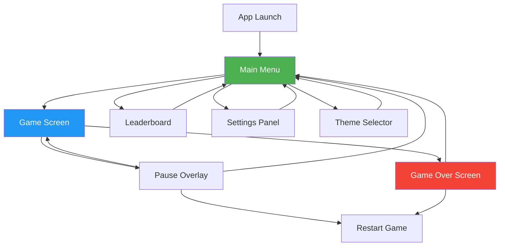
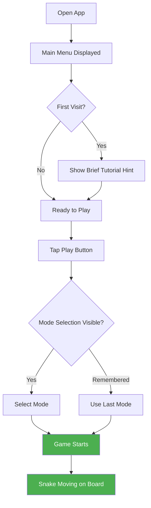
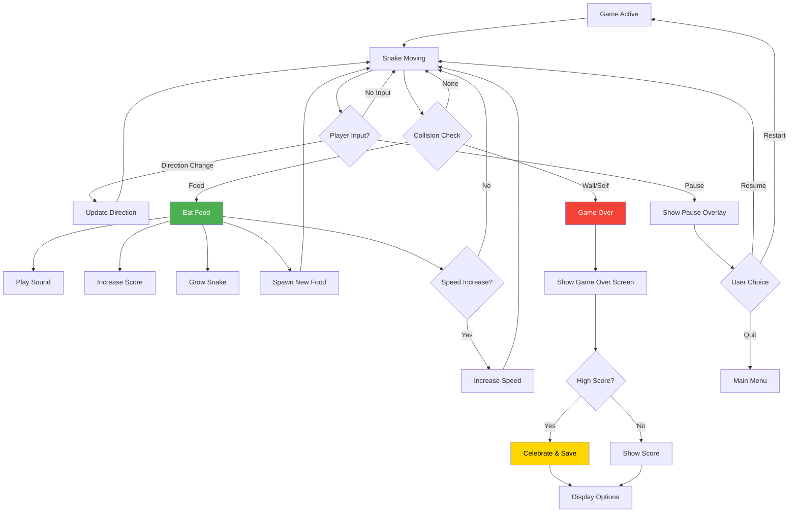
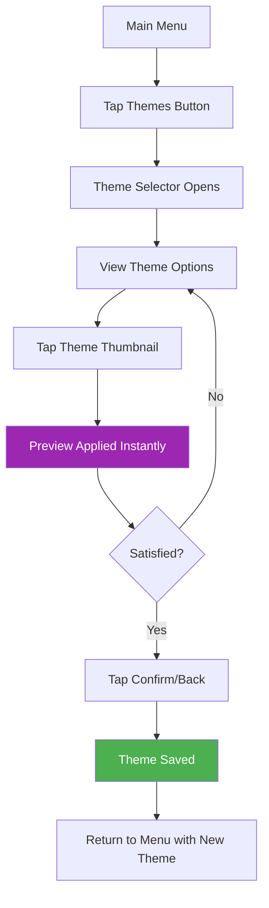
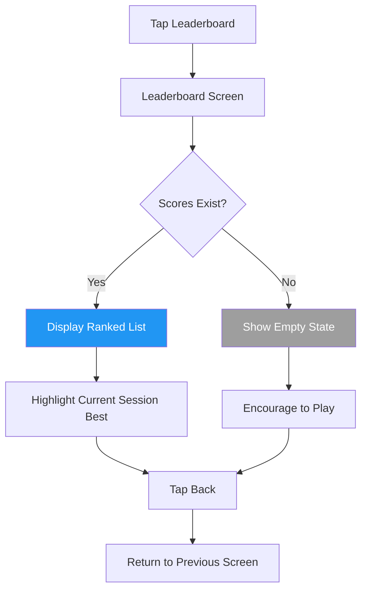

# Snake Game - UI/UX Specification

## Introduction

This document defines the user experience goals, information architecture, user flows, and visual design specifications for the Snake Game's user interface. It serves as the foundation for visual design and frontend development, ensuring a cohesive and user-centered experience tailored for children ages 6-12.

### Overall UX Goals & Principles

#### Target User Personas

**Primary Persona: Young Gamer (Ages 6-12)**
- Elementary and middle school-aged children
- Varying levels of gaming experience (from first-time to casual gamers)
- Short attention spans requiring immediate engagement and rewards
- May play on parents' devices (phones, tablets, computers)
- Motivated by visual rewards, sounds, and beating their own scores
- Need simple, intuitive controls they can understand without reading instructions

**Secondary Persona: Parent/Guardian**
- Adults who want safe, ad-free entertainment for their children
- May help children get started with the game
- Appreciate simple controls and non-addictive gameplay
- Value mute options for audio control

#### Usability Goals

1. **Instant Playability:** Users can start playing within 2-3 taps/clicks from landing
2. **Zero Learning Curve:** Controls are intuitive enough that children understand without instructions
3. **Immediate Feedback:** Every action has clear visual and audio response within 100ms
4. **Forgiving Experience:** Quick restart after game over, no punishment for failure
5. **Accessible Controls:** Multiple input methods (keyboard, touch, on-screen buttons) accommodate all abilities
6. **Session Flexibility:** Games are quick enough for short play sessions (1-3 minutes each)

#### Design Principles

1. **Playful & Vibrant:** Use bright colors, rounded shapes, and animated elements that appeal to children
2. **Big & Tappable:** All interactive elements are large enough for small fingers (minimum 44x44px)
3. **Celebrate Success:** Reward actions with satisfying visuals and sounds (score pops, eating sounds)
4. **Simple & Clear:** Minimal text, rely on icons and visual cues where possible
5. **Safe & Contained:** No external links, ads, or pathways outside the game

### Change Log

| Date | Version | Description | Author |
|------|---------|-------------|--------|
| 2024-12-28 | 1.0 | Initial UI/UX specification | UX Expert Agent |

---

## Information Architecture (IA)

### Site Map / Screen Inventory



### Navigation Structure

**Primary Navigation:** Main Menu serves as the hub with large, clearly labeled buttons:
- **Play** (most prominent) - Starts the game
- **Leaderboard** - Views high scores
- **Themes** - Opens theme selector
- **Settings** (gear icon) - Audio controls

**In-Game Navigation:**
- **Pause Button** (top corner) - Opens pause overlay
- **Pause Overlay** - Resume, Restart, Quit to Menu options

**Breadcrumb Strategy:** Not applicable - navigation is hub-and-spoke pattern with Main Menu as central hub. All screens return to Main Menu.

---

## User Flows

### Flow 1: Start New Game

**User Goal:** Begin playing the snake game as quickly as possible

**Entry Points:** App launch, Main Menu

**Success Criteria:** Game is actively running with snake moving on screen



**Edge Cases & Error Handling:**
- First-time users see a subtle hint about controls (dismissible)
- Mode selection remembers last choice
- If localStorage unavailable, default to Classic Mode

**Notes:** The flow from opening the app to active gameplay should take under 3 seconds with 2-3 interactions maximum.

---

### Flow 2: Gameplay Loop

**User Goal:** Play the game, eat food, grow snake, achieve high score

**Entry Points:** Start game from menu or restart

**Success Criteria:** Player experiences satisfying gameplay with clear feedback



**Edge Cases & Error Handling:**
- Rapid direction changes are queued (prevent 180-degree turns)
- Pause automatically if browser tab loses focus
- Game state preserved during pause

**Notes:** The core loop should feel responsive and rewarding. Every food consumption should feel like a small victory.

---

### Flow 3: Theme Selection

**User Goal:** Change the visual theme of the game

**Entry Points:** Main Menu > Themes button

**Success Criteria:** New theme applied and persisted



**Edge Cases & Error Handling:**
- Theme previews instantly on selection
- Back button without selection keeps current theme
- localStorage failure falls back to default Jungle theme

**Notes:** Theme selection should feel like browsing a fun catalog. Thumbnails show representative colors and style.

---

### Flow 4: View Leaderboard

**User Goal:** See top high scores

**Entry Points:** Main Menu > Leaderboard button, Game Over screen

**Success Criteria:** User can see ranked list of top 10 scores



**Edge Cases & Error Handling:**
- Empty state shows friendly message: "No scores yet! Play to set a record!"
- Current session's high score highlighted if present
- Scores show mode (Classic/Speed) for context

---

## Wireframes & Mockups

### Design Files

**Primary Design Files:** To be created in Figma/design tool based on this specification. ASCII wireframes provided below for conceptual layout.

### Key Screen Layouts

#### Main Menu Screen

**Purpose:** Central hub for accessing all game features

**Key Elements:**
- Game title with playful typography and subtle animation
- Large "PLAY" button (primary action, most prominent)
- Secondary buttons: Leaderboard, Themes
- Settings gear icon (top corner)
- Current theme colors visible as background

**Layout (Mobile):**
```
┌─────────────────────────────┐
│  ⚙️                         │
│                             │
│      🐍 SNAKE GAME 🐍       │
│                             │
│    ┌─────────────────┐      │
│    │                 │      │
│    │      PLAY       │      │
│    │                 │      │
│    └─────────────────┘      │
│                             │
│  ┌──────────┐ ┌──────────┐  │
│  │Leaderboard│ │  Themes  │  │
│  └──────────┘ └──────────┘  │
│                             │
│     🎮 Classic │ ⚡ Speed    │
│         ●          ○        │
│                             │
└─────────────────────────────┘
```

**Interaction Notes:**
- Play button has hover/press animation (scale up slightly)
- Mode toggle is easily tappable
- Settings gear opens overlay panel
- Theme colors affect background and accents

---

#### Game Screen

**Purpose:** Active gameplay area with score and controls

**Key Elements:**
- Game board (square grid, centered)
- Current score display (top)
- Pause button (top corner)
- On-screen D-pad controls (bottom, mobile only)
- Current mode indicator (subtle)

**Layout (Mobile):**
```
┌─────────────────────────────┐
│  ⏸️        SCORE: 150       │
│           🎮 Classic        │
│  ┌─────────────────────┐    │
│  │                     │    │
│  │    ██████           │    │
│  │         █           │    │
│  │         █           │    │
│  │         █    🍎     │    │
│  │                     │    │
│  │                     │    │
│  └─────────────────────┘    │
│                             │
│          [ ▲ ]              │
│      [ ◀ ]   [ ▶ ]          │
│          [ ▼ ]              │
│                             │
└─────────────────────────────┘
```

**Layout (Desktop):**
```
┌───────────────────────────────────────────────┐
│     ⏸️              SCORE: 150                │
│                    🎮 Classic                  │
│                                               │
│         ┌─────────────────────────┐           │
│         │                         │           │
│         │      ██████████         │           │
│         │               █         │           │
│         │               █         │           │
│         │               █    🍎   │           │
│         │                         │           │
│         │                         │           │
│         └─────────────────────────┘           │
│                                               │
│         Use Arrow Keys to Control             │
│                                               │
└───────────────────────────────────────────────┘
```

**Interaction Notes:**
- D-pad buttons hidden on desktop (keyboard controls shown instead)
- Score updates with pop animation on increment
- Pause button always accessible
- Game board scales to fit viewport while maintaining aspect ratio

---

#### Pause Overlay

**Purpose:** Pause game and provide navigation options

**Key Elements:**
- Semi-transparent backdrop (game visible behind)
- "PAUSED" title
- Resume, Restart, Quit buttons (stacked vertically)

**Layout:**
```
┌─────────────────────────────┐
│▓▓▓▓▓▓▓▓▓▓▓▓▓▓▓▓▓▓▓▓▓▓▓▓▓▓▓▓│
│▓▓                        ▓▓│
│▓▓       ⏸️ PAUSED        ▓▓│
│▓▓                        ▓▓│
│▓▓   ┌────────────────┐   ▓▓│
│▓▓   │     RESUME     │   ▓▓│
│▓▓   └────────────────┘   ▓▓│
│▓▓   ┌────────────────┐   ▓▓│
│▓▓   │    RESTART     │   ▓▓│
│▓▓   └────────────────┘   ▓▓│
│▓▓   ┌────────────────┐   ▓▓│
│▓▓   │      QUIT      │   ▓▓│
│▓▓   └────────────────┘   ▓▓│
│▓▓                        ▓▓│
│▓▓▓▓▓▓▓▓▓▓▓▓▓▓▓▓▓▓▓▓▓▓▓▓▓▓▓▓│
└─────────────────────────────┘
```

**Interaction Notes:**
- Backdrop click/tap does NOT dismiss (intentional - prevent accidental resume)
- Escape key or Resume button to continue
- Buttons have clear hover/focus states

---

#### Game Over Screen

**Purpose:** Show final score and provide next actions

**Key Elements:**
- "GAME OVER" title
- Final score (large, prominent)
- High score celebration (if achieved)
- Play Again and Main Menu buttons

**Layout:**
```
┌─────────────────────────────┐
│                             │
│       💀 GAME OVER 💀       │
│                             │
│          SCORE              │
│           350               │
│                             │
│     🏆 NEW HIGH SCORE! 🏆    │
│                             │
│   ┌────────────────────┐    │
│   │    PLAY AGAIN      │    │
│   └────────────────────┘    │
│   ┌────────────────────┐    │
│   │     MAIN MENU      │    │
│   └────────────────────┘    │
│                             │
└─────────────────────────────┘
```

**Interaction Notes:**
- High score message only shown when applicable
- Score has celebratory animation on new high score
- Play Again is primary action (more prominent)
- Subtle death animation before this screen appears

---

#### Leaderboard Screen

**Purpose:** Display top 10 high scores

**Key Elements:**
- Title "LEADERBOARD"
- Ranked list of scores with mode and date
- Back button
- Current session highlight

**Layout:**
```
┌─────────────────────────────┐
│  ←     🏆 LEADERBOARD 🏆    │
│                             │
│  ┌─────────────────────┐    │
│  │ 1. 🥇  450  Classic │    │
│  │ 2. 🥈  380  Speed   │    │
│  │ 3. 🥉  350  Classic │◀── │
│  │ 4.     320  Speed   │    │
│  │ 5.     290  Classic │    │
│  │ 6.     250  Classic │    │
│  │ 7.     220  Speed   │    │
│  │ 8.     180  Classic │    │
│  │ 9.     150  Classic │    │
│  │10.     120  Speed   │    │
│  └─────────────────────┘    │
│                             │
│     Play to beat #1!        │
│                             │
└─────────────────────────────┘
```

**Interaction Notes:**
- Arrow indicates current session's score if present
- Medal icons for top 3
- Scrollable if needed on small screens
- Empty state shows encouraging message

---

#### Theme Selector

**Purpose:** Browse and select visual themes

**Key Elements:**
- Grid of theme preview thumbnails
- Theme names
- Current selection indicator
- Back/confirm navigation

**Layout:**
```
┌─────────────────────────────┐
│  ←      🎨 THEMES 🎨        │
│                             │
│  ┌─────┐ ┌─────┐ ┌─────┐   │
│  │ 🌴  │ │ 🌊  │ │ 🚀  │   │
│  │Jungle│ │Ocean│ │Space│   │
│  │  ✓  │ │     │ │     │   │
│  └─────┘ └─────┘ └─────┘   │
│                             │
│  ┌─────┐ ┌─────┐ ┌─────┐   │
│  │ 🍬  │ │ 💜  │ │ 🏜️  │   │
│  │Candy│ │Neon │ │Desert│   │
│  │     │ │     │ │     │   │
│  └─────┘ └─────┘ └─────┘   │
│                             │
│  ┌─────┐                    │
│  │ ❄️  │                    │
│  │Winter│                   │
│  │     │                    │
│  └─────┘                    │
└─────────────────────────────┘
```

**Interaction Notes:**
- Thumbnails show representative colors
- Checkmark on current selection
- Tapping applies theme instantly (live preview)
- Back button confirms selection

---

#### Settings Panel

**Purpose:** Control audio settings

**Key Elements:**
- Sound effects toggle
- Music toggle
- Visual indicators for on/off state

**Layout:**
```
┌─────────────────────────────┐
│  ←       ⚙️ SETTINGS        │
│                             │
│  ┌─────────────────────┐    │
│  │                     │    │
│  │  🔊 Sound Effects   │    │
│  │           [ON ]     │    │
│  │                     │    │
│  │  🎵 Music           │    │
│  │           [OFF]     │    │
│  │                     │    │
│  └─────────────────────┘    │
│                             │
│                             │
└─────────────────────────────┘
```

**Interaction Notes:**
- Toggle switches with clear on/off states
- Changes apply immediately
- Settings persist in localStorage

---

## Component Library / Design System

### Design System Approach

**Custom Tailwind-based Design System:** Build a lightweight, game-specific design system using Tailwind CSS with custom theme configuration. Components will be React functional components with consistent styling patterns.

### Core Components

#### Button

**Purpose:** Primary interactive element for all actions

**Variants:**
- Primary (Play, Resume) - Large, prominent, theme primary color
- Secondary (Leaderboard, Themes, Restart) - Medium, theme secondary color
- Tertiary (Quit, Back) - Text-style or outlined
- Icon (Settings, Pause) - Icon-only circular button

**States:**
- Default, Hover, Active/Pressed, Focused, Disabled

**Usage Guidelines:**
- Minimum size 44x44px for touch targets
- Primary buttons have bold text and shadow
- Use consistent border-radius (rounded-xl or rounded-full)
- Include subtle scale animation on press

---

#### Game Board

**Purpose:** Container for the snake game grid

**Variants:**
- Standard (fixed grid size)
- Responsive (scales to container)

**States:**
- Active (game running), Paused (dimmed), Game Over (frozen)

**Usage Guidelines:**
- Maintain square aspect ratio
- Grid cells have subtle borders or gaps
- Background color from current theme
- Border with theme accent color

---

#### Snake Segment

**Purpose:** Individual segment of the snake body

**Variants:**
- Head (distinct shape/color)
- Body (standard segment)
- Tail (optional distinct shape)

**States:**
- Normal, Eating (brief scale), Collision (flash)

**Usage Guidelines:**
- Colors from current theme's snake palette
- Slight rounded corners for friendly appearance
- Head may have simple eyes or direction indicator

---

#### Food Item

**Purpose:** Collectible item on the game board

**Variants:**
- Standard food (per theme - apple, fish, star, etc.)

**States:**
- Idle (subtle pulse animation), Consumed (pop and disappear)

**Usage Guidelines:**
- Visually distinct from snake and background
- Centered in grid cell
- Idle animation draws attention

---

#### D-Pad Controls

**Purpose:** On-screen directional controls for touch devices

**Variants:**
- Full D-Pad (4 directions)
- Compact (for very small screens)

**States:**
- Default, Pressed (visual feedback)

**Usage Guidelines:**
- Position at bottom of screen for thumb access
- Semi-transparent to not fully obstruct view
- Large touch targets (minimum 48px)
- Hide on desktop viewport

---

#### Score Display

**Purpose:** Show current game score

**Variants:**
- In-game (compact), Game Over (large, celebratory)

**States:**
- Normal, Incrementing (pop animation)

**Usage Guidelines:**
- Clear, readable font
- High contrast against background
- Position consistently (top center)

---

#### Toggle Switch

**Purpose:** On/off control for settings

**Variants:**
- Standard (with label)

**States:**
- On, Off, Focused

**Usage Guidelines:**
- Clear visual distinction between on/off
- Smooth transition animation
- Large enough for easy touch control

---

#### Overlay/Modal

**Purpose:** Overlay content on top of game (pause, game over)

**Variants:**
- Full overlay (pause, game over)
- Panel (settings, themes)

**States:**
- Opening (fade in), Open, Closing (fade out)

**Usage Guidelines:**
- Semi-transparent backdrop
- Centered content card
- Smooth fade animation
- Trap focus within modal for accessibility

---

## Branding & Style Guide

### Visual Identity

**Brand Guidelines:** Kid-friendly, playful, colorful gaming aesthetic. No external brand to follow - creating game-specific identity.

**Brand Personality:**
- Fun and energetic
- Friendly and approachable
- Safe and trustworthy
- Rewarding and encouraging

### Color Palette

Each theme has its own color palette. Below is the base/default (Jungle) theme:

| Color Type | Hex Code | Usage |
|------------|----------|-------|
| Primary | #4CAF50 | Main buttons, snake color, positive actions |
| Secondary | #8BC34A | Secondary buttons, accents |
| Accent | #FFEB3B | Highlights, score, achievements |
| Background | #1B5E20 | Game board background |
| Surface | #2E7D32 | Cards, overlays, UI surfaces |
| Text | #FFFFFF | Primary text on dark backgrounds |
| Text Secondary | #C8E6C9 | Secondary/muted text |
| Food | #F44336 | Food item (apple red) |
| Success | #4CAF50 | Positive feedback |
| Warning | #FF9800 | Cautions |
| Error | #F44336 | Errors, game over |

#### Theme Color Palettes

**Ocean Theme:**
| Color Type | Hex Code |
|------------|----------|
| Primary | #0288D1 |
| Secondary | #4FC3F7 |
| Accent | #FFD54F |
| Background | #01579B |
| Surface | #0277BD |
| Snake | #00ACC1 |
| Food | #FF8A65 (fish) |

**Space Theme:**
| Color Type | Hex Code |
|------------|----------|
| Primary | #7C4DFF |
| Secondary | #B388FF |
| Accent | #FFFF00 |
| Background | #1A1A2E |
| Surface | #2D2D44 |
| Snake | #E040FB |
| Food | #FFD700 (star) |

**Candy Theme:**
| Color Type | Hex Code |
|------------|----------|
| Primary | #EC407A |
| Secondary | #F48FB1 |
| Accent | #69F0AE |
| Background | #FCE4EC |
| Surface | #F8BBD9 |
| Snake | #AB47BC |
| Food | #FF7043 (lollipop) |

**Neon Theme:**
| Color Type | Hex Code |
|------------|----------|
| Primary | #00FFFF |
| Secondary | #FF00FF |
| Accent | #FFFF00 |
| Background | #0D0D0D |
| Surface | #1A1A1A |
| Snake | #39FF14 |
| Food | #FF073A |

**Desert Theme:**
| Color Type | Hex Code |
|------------|----------|
| Primary | #FF8F00 |
| Secondary | #FFB74D |
| Accent | #4CAF50 |
| Background | #E65100 |
| Surface | #F57C00 |
| Snake | #8D6E63 |
| Food | #7CB342 (cactus fruit) |

**Winter Theme:**
| Color Type | Hex Code |
|------------|----------|
| Primary | #42A5F5 |
| Secondary | #90CAF9 |
| Accent | #FFF59D |
| Background | #E3F2FD |
| Surface | #BBDEFB |
| Snake | #1E88E5 |
| Food | #B3E5FC (snowflake) |

### Typography

#### Font Families

- **Primary:** 'Fredoka One' or 'Nunito' - Rounded, playful, kid-friendly
- **Secondary:** 'Nunito Sans' - Clean, readable for smaller text
- **Monospace:** 'JetBrains Mono' - Score display (if numeric emphasis needed)

#### Type Scale

| Element | Size | Weight | Line Height |
|---------|------|--------|-------------|
| H1 (Title) | 48px / 3rem | 700 | 1.2 |
| H2 (Screen Title) | 32px / 2rem | 700 | 1.3 |
| H3 (Section) | 24px / 1.5rem | 600 | 1.4 |
| Body | 18px / 1.125rem | 400 | 1.5 |
| Button Text | 20px / 1.25rem | 600 | 1 |
| Small/Caption | 14px / 0.875rem | 400 | 1.4 |
| Score Display | 36px / 2.25rem | 700 | 1 |

### Iconography

**Icon Library:** Lucide React or Heroicons (outline style)

**Usage Guidelines:**
- Use filled icons for active/selected states
- Consistent stroke width (2px)
- Pair with text labels where possible for clarity
- Size: 24px standard, 32px for primary actions

**Custom Icons Needed:**
- Snake head (for logo/branding)
- D-pad arrows (custom styled for game)
- Food items per theme (can be emoji or custom)

### Spacing & Layout

**Grid System:** 
- 4px base unit
- Spacing scale: 4, 8, 12, 16, 24, 32, 48, 64, 96px
- Tailwind defaults with custom additions

**Spacing Scale (Tailwind):**
```
spacing: {
  '0.5': '2px',
  '1': '4px',
  '2': '8px',
  '3': '12px',
  '4': '16px',
  '6': '24px',
  '8': '32px',
  '12': '48px',
  '16': '64px',
  '24': '96px',
}
```

**Layout Principles:**
- Generous padding for touch-friendly UI (minimum 16px)
- Consistent margins between sections (24-32px)
- Center-aligned layouts for focused attention
- Maximum content width on large screens (480px for mobile-first game)

---

## Accessibility Requirements

### Compliance Target

**Standard:** WCAG 2.1 AA (with considerations for child users)

### Key Requirements

**Visual:**
- Color contrast ratios: Minimum 4.5:1 for normal text, 3:1 for large text
- Focus indicators: Visible 2px outline in contrasting color on all interactive elements
- Text sizing: Minimum 16px base font, scalable with browser settings

**Interaction:**
- Keyboard navigation: Full game playable with keyboard (Arrow/WASD keys, Enter, Escape, Tab)
- Screen reader support: Meaningful labels on buttons and controls, game state announcements
- Touch targets: Minimum 44x44px for all interactive elements

**Content:**
- Alternative text: Decorative images marked as such, meaningful icons have labels
- Heading structure: Logical H1-H3 hierarchy on each screen
- Form labels: Settings toggles have associated labels

### Testing Strategy

1. Keyboard-only navigation test
2. Screen reader testing (VoiceOver, NVDA)
3. Color contrast verification with automated tools
4. Touch target size audit
5. Reduced motion preference testing (prefers-reduced-motion)

---

## Responsiveness Strategy

### Breakpoints

| Breakpoint | Min Width | Max Width | Target Devices |
|------------|-----------|-----------|----------------|
| Mobile | 320px | 767px | Phones (iPhone SE to iPhone Pro Max) |
| Tablet | 768px | 1023px | Tablets (iPad, Android tablets) |
| Desktop | 1024px | 1439px | Laptops, desktops |
| Wide | 1440px | - | Large monitors |

### Adaptation Patterns

**Layout Changes:**
- Mobile: Single column, stacked elements, full-width game board
- Tablet: Centered layout, larger game board, more whitespace
- Desktop: Centered with maximum width constraint, generous margins

**Navigation Changes:**
- Mobile/Tablet: On-screen D-pad visible
- Desktop: D-pad hidden, keyboard control hints shown

**Content Priority:**
- Game board always primary focus
- Score always visible
- Controls positioned for comfortable reach (bottom on mobile, not needed on desktop)

**Interaction Changes:**
- Mobile: Touch/swipe primary, on-screen buttons secondary
- Tablet: Touch/swipe or on-screen buttons
- Desktop: Keyboard primary, mouse for menus

---

## Animation & Micro-interactions

### Motion Principles

1. **Purposeful:** Animations serve a function (feedback, guidance, delight)
2. **Quick:** Keep durations short (150-300ms) to feel responsive
3. **Natural:** Use ease-out for entrances, ease-in for exits
4. **Respectful:** Honor prefers-reduced-motion preference
5. **Consistent:** Same animations for same actions throughout

### Key Animations

- **Button Press:** Scale down to 0.95 on press, bounce back (Duration: 100ms, Easing: ease-out)
- **Score Increment:** Pop scale to 1.2, return to 1 (Duration: 200ms, Easing: ease-out)
- **Food Pulse:** Subtle scale 1.0 to 1.1 loop (Duration: 800ms, Easing: ease-in-out)
- **Food Eaten:** Scale up and fade out (Duration: 150ms, Easing: ease-out)
- **Screen Transition:** Fade in/out with slight slide (Duration: 200ms, Easing: ease-out)
- **Game Over:** Brief red flash on collision (Duration: 100ms)
- **High Score Celebration:** Score bounces with particle burst effect (Duration: 500ms)
- **Snake Movement:** Smooth position interpolation between cells (Duration: matches game tick)
- **Theme Change:** Smooth color transition (Duration: 300ms, Easing: ease-in-out)
- **Overlay Appear:** Backdrop fades in, content scales up from 0.9 (Duration: 200ms)

---

## Performance Considerations

### Performance Goals

- **Page Load:** Under 3 seconds on 3G connection
- **Interaction Response:** Under 100ms from input to visual feedback
- **Animation FPS:** Consistent 60fps during gameplay

### Design Strategies

1. **Optimize Assets:**
   - Use SVG for icons and simple graphics
   - Compress images, prefer CSS over images where possible
   - Lazy-load non-critical assets

2. **Efficient Animations:**
   - Use CSS transforms and opacity (GPU-accelerated)
   - Avoid animating layout properties (width, height, top, left)
   - Use will-change sparingly and intentionally

3. **Smart Loading:**
   - Critical CSS inlined
   - Fonts loaded with font-display: swap
   - Code splitting for non-essential screens

4. **Game Loop Optimization:**
   - Use requestAnimationFrame
   - Minimize DOM updates during gameplay
   - Canvas or optimized DOM rendering for game board

---

## Next Steps

### Immediate Actions

1. Review this UI/UX specification with stakeholders
2. Create visual designs in Figma based on wireframes and style guide
3. Prepare asset list (icons, theme graphics, sound effects)
4. Hand off to Architect for front-end architecture document
5. Validate accessibility requirements with testing plan

### Design Handoff Checklist

- [x] All user flows documented
- [x] Component inventory complete
- [x] Accessibility requirements defined
- [x] Responsive strategy clear
- [x] Brand guidelines incorporated
- [x] Performance goals established

---

**Workflow Status:** Stage 3 of 6 | **Next:** Architect creates Front-End Architecture
